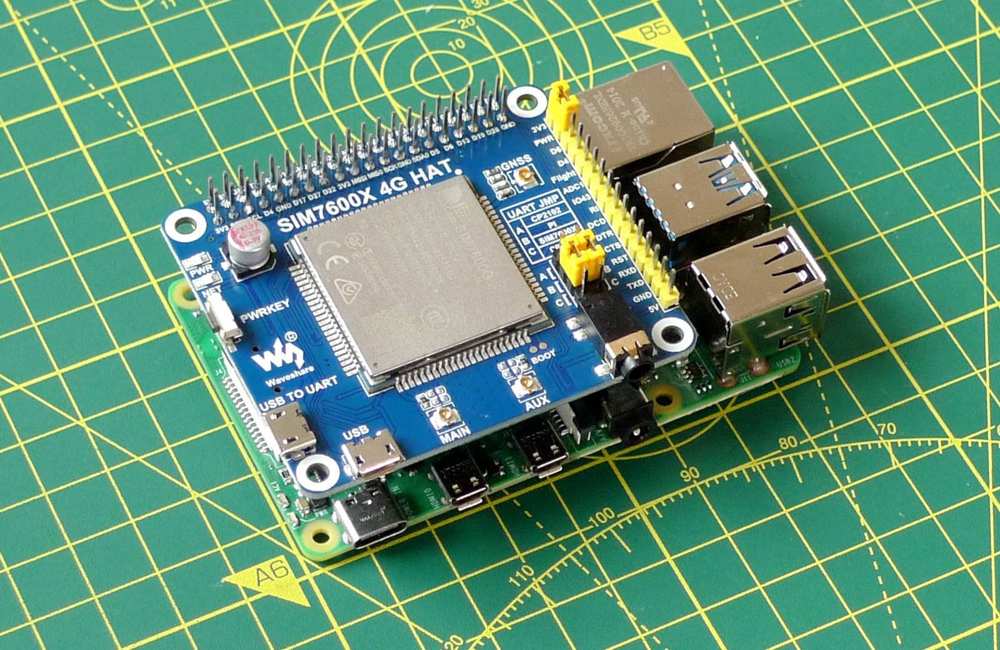

# Programmable Wireless Raspberry Pi Demos

This repo contains the complete Internet of Things (IoT) application built while working through Twilio’s [Programmable Wireless](https://www.twilio.com/docs/iot/wireless) tutorials.

## License and Copyright

All code © 2022, Twilio. Licensed under the terms of the [MIT license](LICENSE.md).